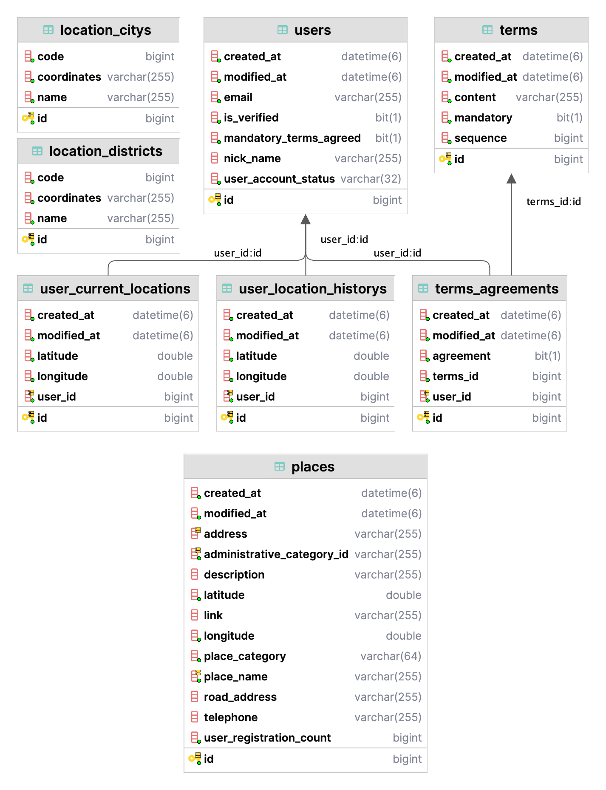

# DayPlan User Server

## 1. 서버의 역할 및 설명
- User Server는 유저를 생성 및 관리하고, 가게 정보를 저장 및 관리하는 역할을 수행해요.
  - 원래는 Place-Server를 따로 분리하려고 했으나 비용 문제 유저에서 관리하고 있어요.
- 가입 절차 및 유저 상태 관리, 인증 등의 과정이 유저 서버에서 이뤄져요

<br/>

## 2. 주요 도메인
- User
  - 해당 서비스에서 요구하는 일련의 인증 절차를 거쳐서 생성된 유저로 정의해요.
  - 유저는 email, 유저 상태, 닉네임, 식별자 등으로 구성이 돼요.
  - 유저는 email로 생성이 되고, 유저 상태에 따라 활동 가능한 영역이 제한돼요.
``` kotlin
    data class User(
        val email: String,
        val userAccountStatus: UserAccountStatus,
        val mandatoryTermsAgreed: Boolean = false,
        val nickName: String = "",
        val userId: Long = 0L,
    )
```
<br/>

- AuthenticationTicket
  - 유저의 인증 정보를 확인하는 인증 티켓이에요.
  - 유저가 생성이 되면, 유저의 식별자로 인증 티켓을 생성해요.
``` kotlin
    data class AuthenticationTicket(
        val accessToken: String,
        val refreshToken: String,
    )
```
<br/>

- Terms
  - 해당 서비스를 이용하기 위한 이용 동의를 받는 약관이에요.
  - 식별자, 필수 여부, 내용 등으로 구성되어 있어요.
``` kotlin
    data class Terms(
        val termsId: Long,
        val sequence: Long,
        val content: String,
        val mandatory: Boolean,
    )
```
<br/>

- TermsAgreement
    - 약관에 대한 유저의 동의 여부를 나타내는 도메인이에요.
    - 유저 식별자, 약관 식별자, 동의 여부를 포함해요.
``` kotlin
    data class TermsAgreement(
        val userId: Long,
        val termsId: Long,
        val agreement: Boolean,
    )
```
<br/>

- UserLocation
  - 유저의 위치를 표현하는 도메인에요.
  - 유저 식별자와 WGS84 좌표계를 기반으로 한 위도, 경도로 구성되어 있어요.
``` kotlin
    data class UserLocation(
        val user: User,
        val latitude: Double,
        val longitude: Double,
    )
```
<br/>

- Place
  - Place는 가게(장소)를 의미하는 도메인으로, "스타벅스", "이디야"를 표현하는 모델이에요.
  - 식별자, 주소, 전화번호, 위도와 경도를 포함하는 것으로 Place는 장소 혹은 상업 시설을 의미할 수 있어요.
``` kotlin
    data class Place(
        val administrativeCategoryId: String,
        val placeName: String,
        val placeCategory: PlaceCategory,
        val latitude: Double,
        /* 중략 */
    )
```
<br/>

## 3. DB 구조

<br/>

## 4. 각 기능별 구현
- > #### [유저 등록 과정을 설명해요](https://github.com/DayPlan-Team/dayplan-user-api/blob/main/readme/UserRegistration.md)

- > #### [가게 정보를 제공하고 내부적으로 저장하는 서비스를 소개해요!](https://github.com/DayPlan-Team/dayplan-user-api/blob/main/readme/PlaceService.md)
<br/>

## 5. TODO
- 회원 탈퇴 및 상태 변경, 프로필 변경등 기능을 추가 해야해요!