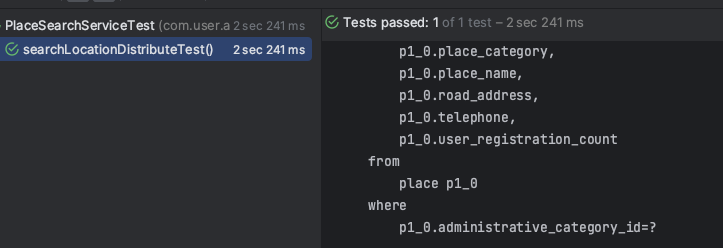

# 가게 정보를 제공하고 내부적으로 저장하는 서비스를 소개해요.

## 1. 배경
- 데이트 코스를 짤 떄, 특정 지역에 있는 카테고리의 가게 정보가 필요했어요.
  - ex) "서울 강남구에 있는 카페"

- 가게 정보를 직접 구축할 수 없는 한계가 있어서, [네이버의 지역 검색 API](https://developers.naver.com/docs/serviceapi/search/local/local.md)를 활용하여 가게 정보를 얻었어요.
- 외부 API 호출은 일일 요청 제한이 있기에, 한 번 요청된 가게 정보는 저장하여 서버에서 자체적인 DB를 구축해야 했어요.

<br/>

## 2. 기능 구현 목표
- 유저가 특정 지역에 있는 카테고리로 가게 정보를 요청하면, 내부에 place 정보가 있는지 확인해요.
- 서버에 Place가 있다면 유저에게 제공하고, 없다면 외부 API에 가게 정보를 요청해요.
- 응답받은 가게 정보를 서버에 저장하고, 유저에게 제공해요.


<br/>

## 3. 기능 구현의 한계 및 해결책
- 유저는 지역과 카테고리를 선택하면 해당 카테고리에 해당하는 page = 1의 가게 정보를 얻어요.
- 유저는 받은 가게 리스트가 마음에 들지 않는다면, 앱의 슬라이드를 내리게 되요. (page = 2에 대한 요청을 수행해요)
- 처음에 제공한 가게와 다른 가게를 제공해야해요.
  - 서버는 두번째 페이지에 해당하는 가게 정보를 요청해야 해요. 
- 겹치지 않는 특정 지역 카테고리의 가게 정보를 제공해야 했어요.
- 해결책으로 Place에 administrative_category_id를 정의하여 "city_district_category페이지번호"로 저장될 수 있도록 설정하였어요.


<br/>

## 4.PlaceService: 코드 구현

- AddressUtil에서 cityCode, districtCode, category, actualStart(페이지)를 요청받아서 AdministrativeCategoryId를 생성해요.
``` kotlin
  fun createAdministrativeCategorySequence(
    cityCode: Long,
    districtCode: Long,
    category: PlaceCategory,
    sequence: Int
  ): String {
    return StringBuilder().append("$cityCode").append("_").append("$districtCode").append("_").append("$category")
        .append("$sequence").toString()
  }
```
<br/>

- PlaceService를 정의해요.
``` kotlin
  @Service
  class PlaceSearchService(
      private val placeSearchPort: PlaceSearchPort,
      private val placePort: PlacePort,
      private val distributeLock: DistributeLock<Place>
  ) {
      fun searchPlace(
          place: String,
          placeCategory: PlaceCategory,
          start: Int,
          administrativeCategoryId: String,
      ): List<Place> {
```
<br/>

- PlaceService에서  AdministrativeCategoryId를 바탕으로 Place를 찾아오고 정보가 있다면 리턴해요.
- 없는 경우 장소를 placeSearchPort를 호출해요
``` kotlin
    val placesByAdministrativeCategory = placePort.getPlacesByAdministrativeCategoryId(administrativeCategoryId)

    if (placesByAdministrativeCategory.isNotEmpty()) {
        return placesByAdministrativeCategory
    }

    val placeItemResponse = placeSearchPort.searchLocation(place, start)
```
<br/>

- place 정보를 얻으면, 분산락으로 가게 정보를 저장해요.
- 최초 락을 잡은 후, 리트라이로 요청을 대기하고 람다를 호출해서 다시 검색을 수행하고, 없다면 플레이스를 저장해요.
``` kotlin
  val places = placeItemResponse.items.map {
      val latitude = transformLatitude(it.mapy)
      val longitude = transformLongitude(it.mapx)
  
      placePort.getPlaceOrNullByAddress(it.address) ?: run {
          distributeLock.withLockRetry(
              distributeLockType = DistributeLockType.PLACE_REGISTRATION,
              key = it.address,
              lockTime = 2_000,
              exception = UserException(UserExceptionCode.PLACE_ALREADY_ROCK),
              action = {
                  placePort.getPlaceOrNullByAddress(it.address) ?: run {
                      placePort.upsertPlace(
                          Place(
                              administrativeCategoryId = administrativeCategoryId,
                              /* 중략 */
                          ),
                      )
                  }
              }
          )
      }
  }
```
<br/>

- 람다 로직에서 Place 정보를 조회하고 다시 저장하는 이유는 다음과 같아요.
- 만약 조회하지 않고 바로 저장 요청을 수행하면 기존에 존재하는 값을 초기화하는 문제가 발생해요.
- place에 대한 정보는 동일하지만 식별자가 달라지는 문제가 발생해요.
- 데이터 정합성을 위해 조회 후 Place를 저장해요.


<br/>

## 5.NaverPlaceSearchAdapter: 코드 구현

- NaverPlaceSearchAdapter로 PlaceSearchPort 구현체를 정의해요.
- 외부 API 요청은 retrofit을 적용하였어요.
- 만약 가게 정보를 찾을 수 없는 경우 지역 가게를 찾을 수 없다는 예외를 던지고, 네트워크 에러의 경우 서버 에러를 발생시켰어요.
``` kotlin
  @Component
  class NaverPlaceSearchAdapter(
      private val naverSearchClient: NaverSearchClient,
  ) : PlaceSearchPort {
      override fun searchLocation(place: String, start: Int): PlacePortItemResponse {
          try {
  
              val location = naverSearchClient.searchLocation(place)
  
              val response = location.execute()
              if (response.isSuccessful) {
                  return response.body() ?: PlacePortItemResponse()
              }
  
              throw UserException(UserExceptionCode.NOT_FOUND_LOCATION_PLACE)
  
          } catch (e: IOException) {
              throw SystemException(SystemExceptionCode.NETWORK_SERVER_ERROR)
          }
      }
  
      companion object : Logger()
  }
```
<br/>


## 6.테스트
- Place 중복 저장에 대한 동시성 테스트를 진행해요.
- 네이버 검색엔진 외부 의존성을 활용해야하는 요청은 모킹해요.

``` kotlin

  @ActiveProfiles("test")
  @SpringBootTest(classes = [ApplicationTestConfiguration::class])
  class PlaceSearchServiceTest {
  
      @Autowired
      private lateinit var placeSearchService: PlaceSearchService
      
      @MockkBean
      private lateinit var placeSearchPort: PlaceSearchPort
  
      val placeItems = listOf(
            PlaceItem(
                title = "당근",
                link = "www.karrot.com",
                category = "카페",
                description = "중고마켓",
                telephone = "010-0000-1111",
                address = "강남역 교보타워1",
                roadAddress = "강남역 교보타워 1",
                mapx = "123001002",
                mapy = "3701002",
            ),
            PlaceItem(
                title = "당근페이",
                link = "www.karrotpay.com",
                category = "카페",
                description = "페이",
                telephone = "010-0000-1112",
                address = "강남역 교보타워2",
                roadAddress = "강남역 교보타워 2",
                mapx = "123001003",
                mapy = "3701003",
            ),
        )
```
<br/>

- countDownLatch로 동시 저장 요청 10회를 수행해요.
- 동시성을 잡지 못하면 2건 이상이 조회되어야 해요
``` kotlin

  @Test
  fun searchLocationDistributeTest() {

      /* give */
      /* 외부 의존성을 모킹해요 */
      every { placeSearchPort.searchLocation(any(), any()) } returns PlacePortItemResponse(
          lastBuildDate = "",
          total = 3,
          start = 1,
          display = 3,
          items = placeItems,
      )

      /* when */
      /* 멀티 스레드로 place 검색 요청을 수행해 */
      val threadCount = 10
      val latch = CountDownLatch(threadCount)
      val executorService = Executors.newFixedThreadPool(32)

      repeat(threadCount) {
          executorService.submit {
              try {
                  placeSearchService.searchPlace(
                      place = "강남역 교보타워",
                      placeCategory = PlaceCategory.ACTIVITY,
                      start = 1,
                      administrativeCategoryId = "1234"
                  )
              } finally {
                  latch.countDown()
              }
          }
      }
      latch.await()


      val result = placeSearchService.searchPlace(
          place = "강남역 교보타워",
          placeCategory = PlaceCategory.ACTIVITY,
          start = 1,
          administrativeCategoryId = "1234"
      )

      /* then */
      /* place 개수는 당근, 당근페이 2개만 조회되어야 해요 */
      result.size shouldBe 2L
  }

```
<br/>

- 테스트 결과 정상적으로 2건만 조회되었어요 (중복 저장 없이 2건만 저장되었어요)



