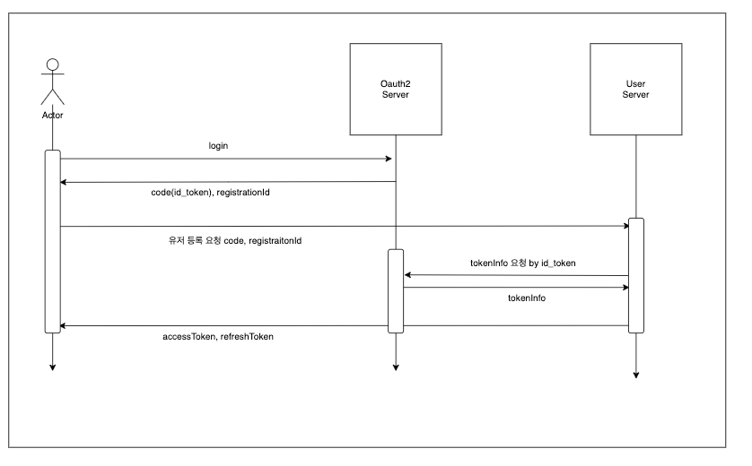

# 유저 등록 과정

## 1. 배경
- 해당 프로젝트는 신뢰할 수 있는 리뷰를 작성하는 것이 중요한 요구사항 이에요.
- 따라서, 유저는 신뢰할 수 있는 인증을 바탕으로 생성될 수 있는 것이 요구사항이에요.

<br/>

## 2. 기능 구현 목표
- 유저 등록은 Oauth2 소셜 로그인 방식으로 인증되도록 구현하였어요.
- 클라이언트가 소셜 로그인으로 얻은 code, registrationId를 전달해요.
  - code: 소셜 로그인이 전달하는 유저를 식별할 수 있는 식별 코드에요.
  - registrationId: 소셜 로그인 방식을 정의하는 식별자에요.
- 서버는 이 값을 소셜 로그인 인증 api를 호출하여 email을 얻어서 가입을 진행시키는 것이 목표에요.
- 현재는 구글 로그인만 유효한 상태에요.



<br/>

## 3. 유저 생성 - 코드 구현
- code, registrationId 요청을 바탕으로 유저의 소셜 로그인 email을 요청하고, 가입하는 코드를 구현해요.
- 해당 서비스의 함수는 소셜 인증으로 얻은 source로 등록한 유저가 존재하지 않으면 유저를 생성해요.
``` kotlin
    @Service
    class UserRegistrationService(
        private val userCreationUseCase: UserCreationUseCase,
        private val userCreationCommandPort: UserCreationCommandPort,
        private val userAccountSocialSourcePort: UserAccountSocialSourcePort,
        private val userQueryPort: UserQueryPort,
    ) {
        
        @Transactional
        fun createUserIfSocialRegistrationNotExists(request: UserAccountSocialCreationRequest): User {
            val userSourceResponse = getSocialUserSourceBySocialRequest(request)
    
            val findUser = userQueryPort.findUserByEmailOrNull(userSourceResponse.email)
            if (findUser != null) return findUser
    
            val user = userCreationUseCase.createUser(
                UserCreationRequest(
                    email = userSourceResponse.email,
                    accountStatus = UserAccountStatus.NORMAL,
                )
            )
    
            return userCreationCommandPort.save(user)
        }
        
        private fun getSocialUserSourceBySocialRequest(request: UserAccountSocialCreationRequest): UserSourceResponse {
            return userAccountSocialSourcePort.getSocialUserSource(request.code, request.socialType)
        }
```
<br/>

- userAccountSocialSourcePort는 어댑터 패턴으로 구성하였어요.
- 비록 지금은 구글 로그인만 구현된 상태이지만 확장성을 고려한 설계 도입을 시도하였어요.
``` kotlin
    @Primary
    @Qualifier("userAccountSocialSourceAdapterFactory")
    @Component
    class UserAccountSocialSourceAdapterFactory(
        private val userAccountGoogleSourceAdapter: UserAccountGoogleSourceAdapter,
    ) : UserAccountSocialSourcePort {
        override fun getSocialUserSource(code: String, socialType: SocialType): UserSourceResponse {
            return when (socialType) {
                SocialType.GOOGLE -> userAccountGoogleSourceAdapter.getSocialUserSource(code, socialType)
            }
        }
    }
```
<br/>

- 구글 로그인은 retrofit을 호출하여 구글 인증 정보를 얻고, 유저에게 필요한 email 정보만 활용하였어요.
``` kotlin
    @Qualifier("userAccountGoogleSourceAdapter")
    @Component
    class UserAccountGoogleSourceAdapter(
        private val googleAccountClient: GoogleAccountClient,
    ) : UserAccountSocialSourcePort {
        override fun getSocialUserSource(code: String, socialType: SocialType): UserSourceResponse {
    
            val response = getGoogleValidatedTokenResponseFromIdToken(code)
    
            return UserSourceResponse(
                email = response.email,
            )
        }
    
        private fun getGoogleValidatedTokenResponseFromIdToken(idToken: String): GoogleValidatedTokenResponse {
            val callback = try {
                googleAccountClient.getGoogleResponseByIdToken(idToken)
            } catch (e: Exception) {
                throw SystemException(SystemExceptionCode.SOCIAL_LOGIN_TIME_ERROR)
            }
    
            val response = callback.execute()
            if (response.isSuccessful) {
                response.body()?.let {
                    return it
                } ?: throw UserException(UserExceptionCode.USER_NOT_VERIFIED)
            }
            else throw SystemException(SystemExceptionCode.SOCIAL_LOGIN_TIME_ERROR)
        }

```
<br/>

## 4. 유저 인증 티켓 - 코드 구현
- 유저 인증 티켓은 도메인의 유즈케이스로 구현한 AuthenticationTicketUseCase를 구현하여 사용하였어요.
- 어댑터 계층에 구현체를 정의하였는데, jwt 모듈 의존성을 도메인에 정의하지 않기 위해 어댑터 계층에 정의하였어요.
  - 어플리케이션 혹은 어댑터 계층에 놓을지 고민하였는데, 외부 라이브러리에 의존하는 것에 초점을 맞춰서 어댑터 계층 구현체를 생성하였어요.

``` kotlin
    override fun afterPropertiesSet() {
        val keyBytes = Decoders.BASE64.decode(secretKey)
        key = Keys.hmacShaKeyFor(keyBytes)
    }

    override fun createAuthenticationTicket(userId: Long): AuthenticationTicket {
        val accessToken = jwtTokenBuilder.buildJwtToken(userId.toString(), accessExpirationTime)
        val refreshToken = jwtTokenBuilder.buildJwtToken(userId.toString(), refreshExpirationTime)

        return AuthenticationTicket(
            accessToken = accessToken,
            refreshToken = refreshToken,
        )
    }
```

## 5. API - 코드 구현
- 앞 서 정의한 유저 생성과 유저 인증 티켓으로 유저 등록 요청에 대한 인증 티켓을 반환해요.
``` kotlin
    @GetMapping("/social/{registrationId}")
    fun createUserIfNotAndCreateAuthenticationTicketBySocial(
        @RequestParam("code") code: String, @PathVariable("registrationId") registrationId: String
    ): ResponseEntity<AuthenticationTicketResponse> {

        val request = UserAccountSocialCreationMapper.mapper(code, registrationId)
        val user = userRegistrationService.createUserIfSocialRegistrationNotExists(request)
        val authenticationTicket = authenticationTicketUseCase.createAuthenticationTicket(user.userId)

        return ResponseEntity.ok(
            AuthenticationTicketResponse(
                accessToken = authenticationTicket.accessToken,
                refreshToken = authenticationTicket.refreshToken,
            ),
        )
    }
```